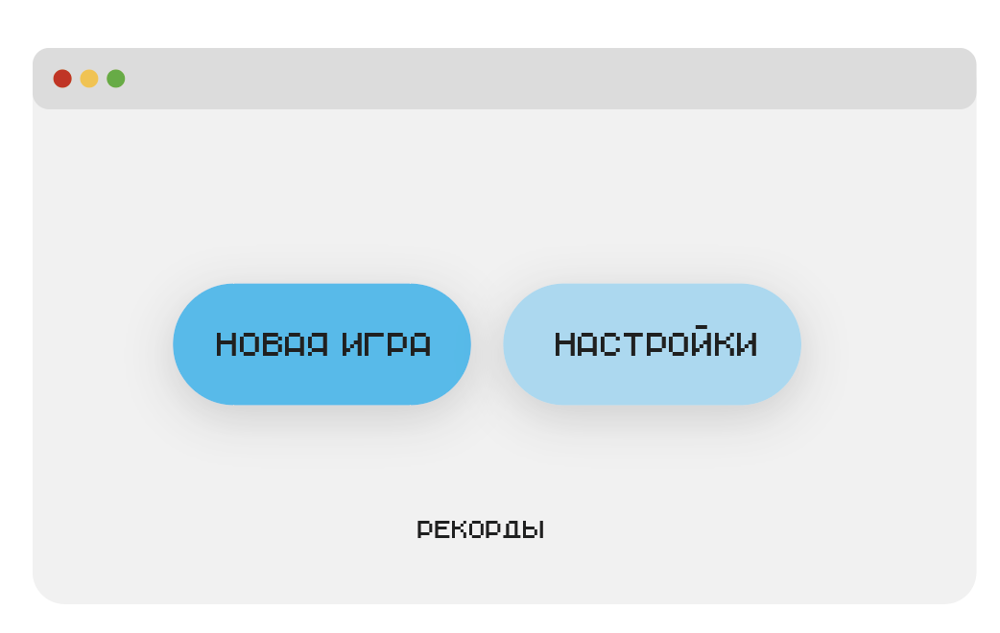
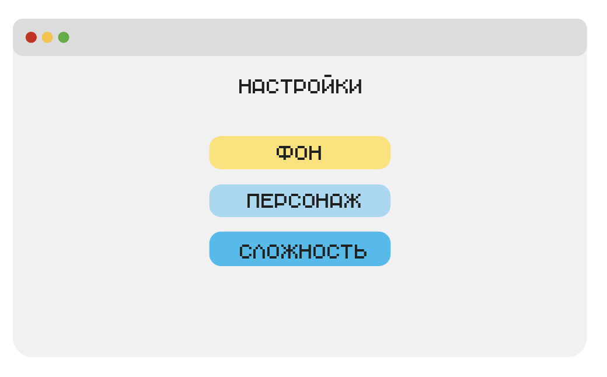
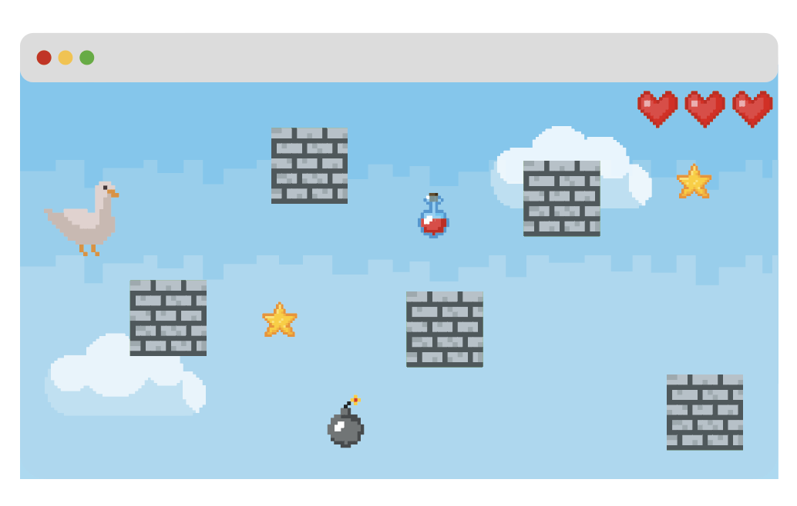

# semester_project
Семестровый проект для курса "Совместная разработка на Python"

Игра, в которой персонажу нужно, облетая препятствия, продвигаться вперёд. Игроку требуется, используя стрелки вверх-вниз, облетать блоки на своем пути, собирать «хорошие» бонусы и избегать «плохие» бонусы. Самостоятельный выход из игры осуществляется кнопкой escape. 

В распоряжении у пользователя есть три жизни. При столкновении с блоком теряется одна жизнь. Игра заканчивается, если все жизни потрачены и происходит столкновение. Игроку предлагается на выбор два режима. Выбрать режим он может после нажатия кнопки НОВАЯ ИГРА.

В первом режиме требуется добраться до финиша. Второй режим представляет из себя бесконечную игру, где цель - продержаться как можно больше времени. В «бесконечном» режиме с течением времени игра усложняется.

Сложность варьируется с помощью расстановки блоков, а также наличия и количества плохих «бонусов».

